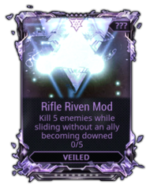
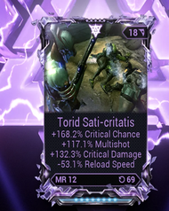

# Riven Market Visualization

A full-stack market analysis tool for Warframe's Riven Mod trading economy. Search live auction data, filter by weapon and attribute combinations, and estimate fair prices using a custom similarity-based pricing engine.

<!--  -->

## Features

- **Live Auction Search** — Query the Warframe Market API with granular filters: weapon, positive/negative attributes, mastery rank, reroll count, polarity, and more
- **Multi-Platform Support** — Search across PC, PS4, Xbox, and Switch with optional crossplay filtering
- **Similarity-Based Price Estimation** — Custom pricing engine that compares a riven's stats against live market data using cosine similarity, archetype classification, and weighted stat importance
- **Smart Caching** — File-based cache with 24-hour TTL and background refresh for weapons, attributes, and riven dispositions — the app stays responsive even when upstream APIs are slow
- **Dynamic Attribute Filtering** — Attributes automatically filter based on weapon type (e.g., melee-only stats won't appear for rifles)

## Architecture

```
┌─────────────────────────────────────────────────────┐
│                    Frontend                         │
│         React 18 · TypeScript · Tailwind            │
│     ┌──────────────┐  ┌───────────────────┐         │
│     │ FilterSidebar│  │    RivenTable     │         │
│     │  (controls)  │→ │ (results + stats) │         │
│     └──────────────┘  └───────────────────┘         │
│              Vite dev server (:8080)                 │
│                  proxies /api/*                      │
└──────────────────┬──────────────────────────────────┘
                   │
         ┌─────────▼─────────┐
         │    Flask API       │
         │    (:5000)         │
         │                    │
         │  server.py         │  ← camelCase ↔ snake_case mapping
         │  rivens.py         │  ← orchestration: normalize → validate → search
         │  cache.py          │  ← 24h TTL, background refresh threads
         │  evaluation/       │  ← pricing engine (5 modules)
         └────┬─────────┬────┘
              │         │
    ┌─────────▼──┐  ┌───▼──────────────┐
    │ warframe   │  │ warframestat.us  │
    │ .market/v1 │  │ (dispositions)   │
    └────────────┘  └──────────────────┘
```

## Pricing Engine

The estimation pipeline goes beyond simple averages:

1. **Stat Weights** — Analyzes the top 30% of auctions by price to determine which stats the market values most for each weapon
2. **Archetype Classification** — Categorizes rivens as Crit, Status, Hybrid, or Other and only compares against compatible builds
3. **Cosine Similarity** — Builds weighted stat vectors and scores each market listing against the target riven, with adjustments for desirable/undesirable negatives
4. **Reroll Penalty** — Exponential decay based on reroll count difference between the target riven and comparables
5. **IQR Outlier Removal** — Filters extreme prices before computing the final weighted average
6. **Price-Tiered Age Decay** — High-value rivens (top 25%) get a gentler staleness penalty since they have a smaller buyer pool and sell slower

## Tech Stack

| Layer | Technology |
|-------|-----------|
| Frontend | React 18, TypeScript, Vite, Tailwind CSS, shadcn/ui, Framer Motion |
| Backend | Python 3.14, Flask |
| APIs | [Warframe Market](https://warframe.market) (auctions), [Warframestat](https://warframestat.us) (dispositions) |
| Testing | Vitest, Playwright (frontend) |

## Getting Started

### Prerequisites
- Python 3.10+
- Node.js 18+

### Backend

```bash
cd backend
pip install flask requests
python main.py
# → API running on http://localhost:5000
```

### Frontend

```bash
cd frontend
npm install
npm run dev
# → App running on http://localhost:8080
```

The Vite dev server proxies all `/api/*` requests to the Flask backend automatically.

## API Endpoints

| Endpoint | Description |
|----------|-------------|
| `GET /api/search` | Search riven auctions with filters |
| `GET /api/estimate` | Similarity-based price estimation for a specific riven |
| `GET /api/riven/weapons` | Cached weapon list (grouped by type) |
| `GET /api/riven/attributes` | Cached attributes (filterable by weapon group) |

## Roadmap

- [ ] Frontend UI for the price estimation endpoint
- [ ] Veiled vs. unveiled riven cost comparison
- [ ] "God roll" analysis — evaluate attribute combinations against ideal rolls

---

## Warframe Terminology

*Warframe is not as mainstream as games like Fortnite, so some terms may be unfamiliar.*

### Riven Mod

A **Riven Mod** is a special type of weapon modification in *Warframe* that becomes unique to a single weapon once revealed.
Each Riven can roll a combination of **positive and negative stats**, such as increased critical damage or reduced zoom.

Riven Mods originate as **veiled Rivens** and must have their challenge completed before the weapon it applies to is revealed.
Before unveiling, the exact weapon is unknown, **only the weapon class is shown.**

**Riven classes include:**

- Rifle
- Shotgun
- Pistol
- Melee
- Archgun
- Kitgun
- Zaw
- Companion Weapon

### Unveiled Riven Mod

An **unveiled Riven Mod** is a Riven that has had its challenge completed and is now bound to a specific weapon (e.g., Torid Riven Mod).

Once unveiled:
- The weapon is permanently revealed
- The Riven's stats can be rerolled using **Kuva** (an in-game resource)
- The Riven can be traded (subject to Mastery Rank requirements)

| Veiled Riven Mod | Unveiled Riven Mod |
|------------------|--------------------|
|  |  |

*Images © Digital Extremes Ltd. Used for educational and illustrative purposes.*

---

This project is not affiliated with or endorsed by Digital Extremes or warframe.market.
